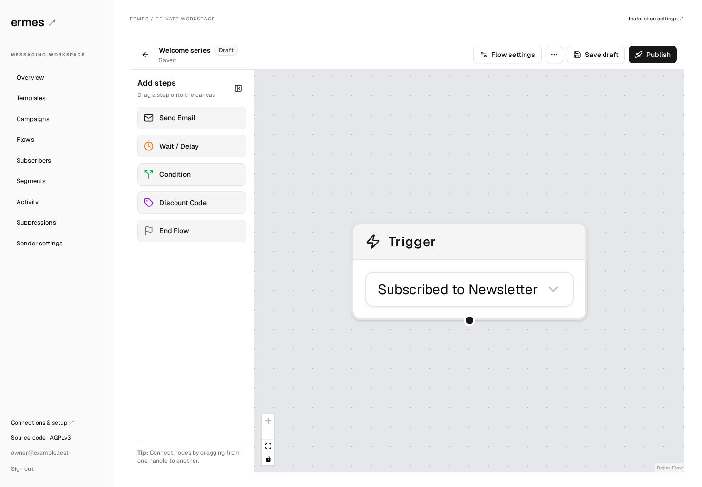
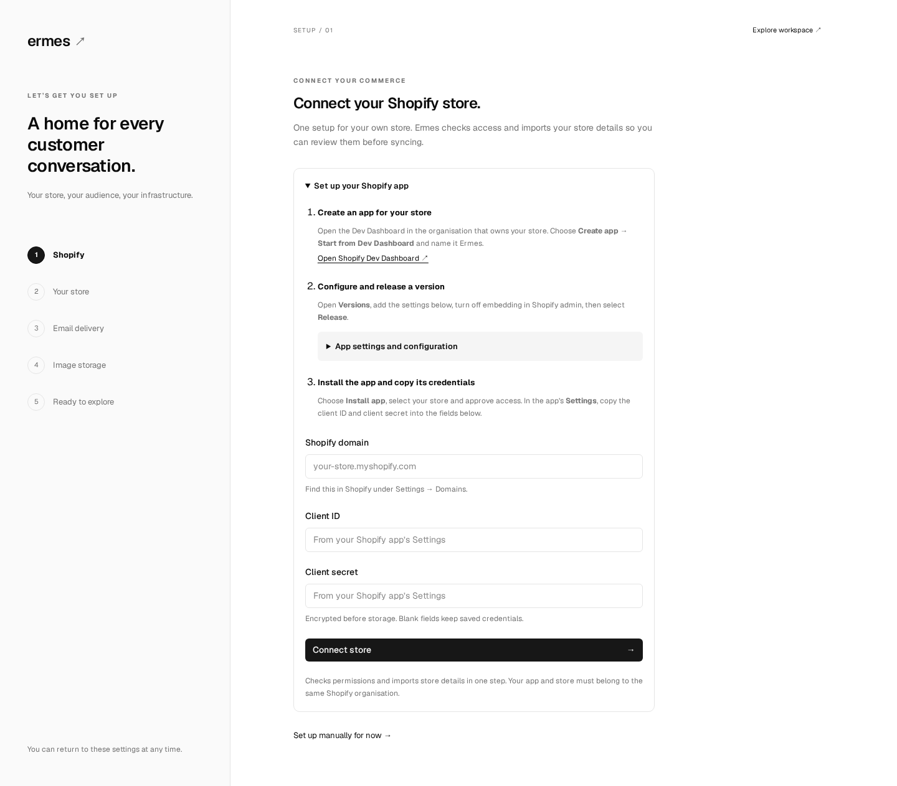

# Ermes

**Open-source email marketing and automation for Shopify.**

[](https://github.com/giaggiola/Ermes/actions/workflows/ci.yml)
[](LICENSE)
[](#quick-start)

Ermes is a self-hosted, open-source email marketing application for Shopify.
Build email campaigns, design automated customer journeys, manage subscribers
and keep your messaging data on infrastructure you control.

One workspace for your audience, templates, campaigns and flows. Your own email
provider. A community project you can inspect, extend and run yourself.

> **Early developer preview.** The frontend, messaging engine and Shopify connector
> are available. Shopify syncing, storefront forms and email delivery require your
> own app/provider setup. This is a self-hosted project, not a Shopify App Store
> listing. See [Shopify setup](docs/shopify.md) and the
> [roadmap](docs/roadmap.md) before planning a production installation.



[Quick start](#quick-start) · [Onboarding](#onboard-your-store) ·
[Server setup](docs/self-hosting.md) · [Roadmap](docs/roadmap.md) ·
[Contributing](CONTRIBUTING.md)

## Why Ermes?

- **Own your audience data.** Subscriber records, consent, campaigns and delivery
  history live in your PostgreSQL database.
- **Build customer journeys visually.** Connect triggers, delays, conditions and
  email steps, then save drafts and publish versions deliberately.
- **Use your own sending account.** Resend is the first supported email provider.
- **Run it with Docker.** The web app, background worker and database run together
  with Docker Compose. No hosted Ermes account is required.
- **Improve it with the community.** The frontend, API and worker are available
  under AGPLv3. Hosting and email-provider costs are paid to the providers you choose.

## Current capabilities

| Capability                                               | Status                                                          |
| -------------------------------------------------------- | --------------------------------------------------------------- |
| Owner setup, login and guided onboarding                 | Available                                                       |
| Template editing and previews                            | Available                                                       |
| Visual flow builder, drafts and versioned publishing     | Available                                                       |
| Campaign management and scheduling                       | Available                                                       |
| Subscribers, segments, suppressions and activity         | Available                                                       |
| Resend sending and signed delivery-event webhooks        | Available; requires your provider configuration                 |
| Consent records, preferences and unsubscribe endpoints   | Available                                                       |
| Encrypted integration credentials and a sending pause    | Available                                                       |
| Image uploads and reusable image library                 | Available; requires your Cloudinary account                     |
| Guided Shopify connection and store import               | Available for an app and store in the same Shopify organisation |
| Shopify order/customer/product syncing                   | Available; resumable imports and signed webhooks                |
| Shopify abandoned-checkout ingestion and recovery checks | Available; current consent and purchase checks                  |
| Storefront visitor identification and cart tracking      | Available for identified, consenting shoppers                   |
| Signup form editor and storefront extension              | Available; published popup/flyout forms                         |
| SMS, multiple stores and hosted Ermes accounts           | Not included                                                    |

The preview supports one store and one owner account per installation. If you are
evaluating a self-hosted alternative to services such as Klaviyo, use the capability
table above and the [roadmap](docs/roadmap.md) to assess whether Ermes fits your
needs. This comparison does not imply feature parity or compatibility with
Klaviyo-specific templates, flows or exports.

## Quick start

You need Git and Docker with the Compose plugin. The commands below work in a
Linux, macOS or WSL terminal. Docker builds the application from source; no npm
registry account or prebuilt Ermes image is required.

```sh
git clone https://github.com/giaggiola/Ermes.git
cd Ermes

# Generate independent installation keys and a private .env file.
docker run --rm --user "$(id -u):$(id -g)" \
  -v "$PWD:/workspace" -w /workspace \
  node:22-alpine node scripts/setup.mjs

docker compose up --build -d
```

If you already have Node 22.12+, use `node scripts/setup.mjs` instead of the
`docker run` setup command. The helper preserves any existing `.env` file.

Open **[http://localhost:3025](http://localhost:3025)**. The first build may take
several minutes. Check startup with:

```sh
docker compose ps
docker compose logs --tail=100 web worker
```

### Running on a remote server?

Keep the default `APP_URL=http://localhost:3025` and open a tunnel **from your own
computer**, using the SSH destination you normally use:

```sh
ssh -N -L 3025:127.0.0.1:3025 user@your-server
```

Keep that terminal open and visit `http://localhost:3025` in your local browser.
For a permanent domain, configure an HTTPS reverse proxy and set `APP_URL` to the
exact browser-facing origin. See [self-hosting](docs/self-hosting.md).

## Onboard your store

1. **Create your owner account.** Choose your email and a password of at least
   12 characters. Registration closes automatically once the owner exists.
   Complete this step locally or through your SSH tunnel before exposing a new
   installation publicly.
2. **Connect Shopify with the guided setup.** Follow the in-page app checklist,
   copy the supplied settings, and enter your store domain and app credentials.
   **Connect store** verifies access and imports your store details in one action.
   Review your sender, then choose **Save and start syncing**. Historical imports
   never send emails; delivery stays paused. You can also set up manually.
3. **Connect email delivery.** Verify your sending domain in Resend, then enter
   your API key. Configure the webhook at
   `https://your-ermes-domain/api/resend/webhook` and save its signing secret.
   A local-only installation can explore the UI without these credentials.
4. **Enable live events and storefront forms.** Download the ready-made app
   configuration from setup and follow the [Shopify guide](docs/shopify.md) to
   publish it with the theme extension. Open Shopify's theme editor from Ermes,
   enable **Ermes signup forms**, and save. Live callbacks need a public HTTPS
   Ermes address. Your app and store must belong to the same Shopify organisation.
5. **Explore with sending paused.** Create templates, organise subscribers and
   save your first flow as a draft. Credentials are encrypted before storage and
   are never displayed again; blank credential fields preserve saved values.
6. **Enable delivery when ready.** Confirm your sender domain is verified before
   enabling email delivery in setup. Published flows and due campaigns may then
   send real email. Test sends also require delivery to be enabled.



Read the [onboarding guide](docs/onboarding.md) for provider setup, configuration
ownership and troubleshooting. Password reset, additional users and guided key
rotation are not available yet.

To upload form images and sender logos, connect your Cloudinary account in the
**Image storage** setup step. The image picker supports uploads and reuse from your
Ermes image library. You can also keep using existing public image URLs.

## Configuration

Deployment settings belong in `.env`; store and provider settings belong in the
onboarding UI. Start from the setup helper instead of inventing or reusing keys.

| Deployment variable             | Purpose                                                             |
| ------------------------------- | ------------------------------------------------------------------- |
| `APP_URL`                       | Exact browser-facing origin, such as `https://messages.example.com` |
| `ERMES_PORT`                    | Local web port; defaults to `3025`                                  |
| `POSTGRES_PASSWORD`             | Password for this installation's database                           |
| `ERMES_SETUP_TOKEN`             | Optional first-owner setup key; blank by default                    |
| `ERMES_ENCRYPTION_KEY`          | Encrypts stored provider credentials                                |
| `PREFERENCE_TOKEN_SECRET`       | Signs customer preference links                                     |
| `OPS_MESSAGING_SHARED_SECRET`   | Internal admin API signing key; generated automatically             |
| `COMMERCE_EVENT_WEBHOOK_SECRET` | Commerce event API signing key; generated automatically             |

`DATABASE_URL` is assembled by Compose. PostgreSQL is not exposed on a host port;
the web port binds to loopback by default. No credentials are included in this repo.
See [`.env.example`](.env.example) and [self-hosting](docs/self-hosting.md).

Back up both the database and `.env`. Losing `ERMES_ENCRYPTION_KEY` makes stored
provider credentials unreadable. Replacing it is not a supported rotation procedure.

## Architecture

```text
apps/web       Next.js frontend, onboarding, sessions and HTTP API
apps/worker    Background automation and delivery workers
packages/core Flow contracts, templates, signing and queue definitions
packages/db   PostgreSQL persistence, migrations and installation settings
packages/ui   Reusable messaging screens and editors
packages/shopify Shopify API, imports, webhooks, recovery and consent
shopify-app    Source and assets for the Shopify theme extension
```

Ermes uses TypeScript, React, Next.js, PostgreSQL and pg-boss. The web process applies
migrations before the worker starts. The UI can also be embedded in an existing
application through a host-supplied API transport; see [embedding](docs/embedding.md).

## Contributing

Ermes is being built as a self-hosted community project. Documentation improvements,
reproducible bug reports and focused pull requests are welcome. Shopify event
integration, onboarding and operational reliability are current priorities.

```sh
npm ci
npm test
npm run typecheck
npm run build
```

The database tests need a disposable database; see [CONTRIBUTING.md](CONTRIBUTING.md)
for the full workflow, browser checks and contribution guidelines.

Use [GitHub issues](https://github.com/giaggiola/Ermes/issues) for bugs and feature
requests, and [discussions](https://github.com/giaggiola/Ermes/discussions) for setup
questions and ideas. Report vulnerabilities privately as described in
[SECURITY.md](SECURITY.md). Never attach `.env`, customer exports or provider keys.

## License

Ermes is licensed under the **GNU Affero General Public License v3.0 only**
(`AGPL-3.0-only`). See [LICENSE](LICENSE). Third-party components retain their own
licenses; see [THIRD_PARTY_NOTICES.md](THIRD_PARTY_NOTICES.md).

Ermes is an independent community project. It is not affiliated with, endorsed by
or sponsored by Klaviyo or Shopify. Third-party names are used to identify the
respective products and services; their trademarks belong to their respective owners.
